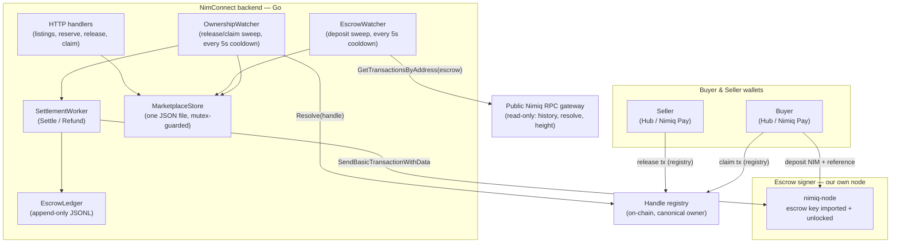
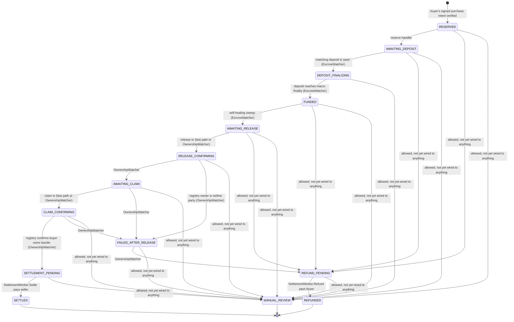
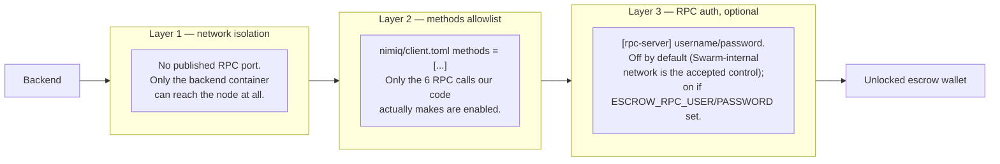

# Marketplace escrow — architecture & operations

This is the current, living map of how the handle marketplace's escrow actually
works — components, trade state machine, the escrow wallet's security model,
and known gaps. It describes the code as it exists in `backend/marketplace_*.go`,
`backend/escrow_wallet.go`, and `backend/nimiq_rpc.go`; if it and the code ever
disagree, the code wins and this doc is stale.

For the original design rationale (why escrow is pooled rather than
per-trade, why release-then-claim rather than atomic swap), see
`docs/superpowers/plans/2026-07-27-marketplace-escrow-core.md` and
`docs/superpowers/plans/2026-07-28-marketplace-wallet-choreography.md`. This
doc is the "how it runs today" companion to those "why we built it this way"
plans.

## Components



Two things this diagram makes explicit that are easy to miss reading the code
file-by-file:

- **The escrow-signer node is a completely separate trust boundary** from the
  public RPC gateway. Everything read-only (chain height, transaction
  history, handle resolution) goes through a public gateway. The only two
  things that ever talk to our own node are (a) importing/unlocking the
  escrow key at startup and on re-checks, and (b) `SendBasicTransactionWithData`
  for an actual payout/refund. See [Escrow wallet security model](#escrow-wallet-security-model).
- **`OwnershipWatcher` doesn't trust the release/claim HTTP endpoints** — it
  independently re-derives trade progress from the registry's own canonical
  current owner of the handle. The HTTP endpoints
  (`marketplaceTradeReleaseHandler`/`marketplaceTradeClaimHandler`) are a
  fast-path UI convenience that pre-advances local state so the buyer/seller
  don't have to wait for the next sweep; the watcher is what actually decides
  settlement, and it recognizes a valid release/claim even if it happened
  through a raw wallet transaction that never touched our API at all.

## Trade lifecycle

Source of truth: `allowedTransitions` in `backend/marketplace.go`. Every
transition below is exactly what that map allows; the label says what
actually triggers it in code today, or flags it as declared-but-unwired.



### Walkthrough

1. **Reserve** — buyer signs a purchase intent for a listing; the handler
   verifies the signature, consumes a one-time nonce, and moves the new
   trade to `AWAITING_DEPOSIT` with the shared escrow address attached.
2. **Deposit** — buyer sends exactly `price_luna` to the escrow address with
   the trade's reference embedded in the tx data (`NME1:<reference>`).
   `EscrowWatcher` matches deposits by **exact value + sender + reference** —
   a wrong amount, a missing reference, or a different sender address will
   never match, and there is currently no recovery path for that money (see
   [Known gaps](#known-gaps)).
3. **Finalize** — once the deposit's block reaches macro finality
   (`GetLastMacroBlockNumber`), the trade moves to `FUNDED`.
4. **Self-heal to AWAITING_RELEASE** — `EscrowWatcher` re-scans every trade
   sitting at `FUNDED` on *every* sweep, not just the moment it first arrives
   there, specifically so a stuck trade (crash, failed transition, bad
   deploy) self-repairs on the next sweep instead of needing intervention.
5. **Release & claim** — seller sends a release transaction to the handle
   registry, buyer sends a claim transaction. Either can be submitted through
   the marketplace API (`POST .../release`, `POST .../claim`) for a fast
   local-state bump, but `OwnershipWatcher` is the actual authority: every
   sweep it asks the registry who currently owns the handle and reacts to
   that reality regardless of how the transfer happened.
6. **Settle or fail** — if the registry says the buyer now owns the handle,
   the watcher walks the trade to `SETTLEMENT_PENDING` and calls
   `SettlementWorker.Settle`, which pays the seller (`price - fee`) from
   escrow. If the registry shows the handle went to neither the buyer nor
   the seller (something else happened on-chain), the watcher fails the
   trade to `FAILED_AFTER_RELEASE` → `REFUND_PENDING`, and
   `SettlementWorker.Refund` returns the buyer's full payment.

### The "in-flight, no hash" guard

Both `Settle` and `Refund` write an attempt marker
(`PayoutAttemptedAt`/`RefundAttemptedAt`) *before* calling the signer, and
refuse to run again if that marker exists without a recorded tx hash:

```go
if trade.PayoutAttemptedAt != 0 && trade.PayoutTxHash == "" {
    return fmt.Errorf("... needs manual reconciliation")
}
```

This is deliberate: if the process crashes or the RPC call times out *during*
signing, we genuinely don't know whether the node broadcast the transaction
or not — blindly retrying risks a double payment, so it stops and waits for a
human to check the chain and reconcile by hand. The cost is that **any**
failed send (network blip, node temporarily unreachable, account locked)
looks identical to that ambiguous case and also stops automatically. The
escrow re-unlock check described below exists specifically to keep "account
locked" from ever being the cause.

## Escrow wallet security model

The escrow private key is imported into, and only ever used from, a Nimiq
node we run ourselves — never a public gateway, which exposes no wallet RPCs
and which we'd never want holding this key regardless
(`backend/main.go`, `backend/escrow_wallet.go`).



None of these three is sufficient alone — they're deliberately independent:
network isolation stops everything except what's on the same Docker/Swarm
network; the methods allowlist stops anything on that network from calling
something other than the six operations we use even if it can reach the
port; RPC auth (when enabled) stops even an allowlisted call without the
right credentials. See `nimiq/client.toml`, `docker-compose.yml`, and
`docker-compose.homelab.yml.example` for the concrete wiring, and the
conversation history in this repo's PR/commit trail for why HTLC and Nimiq
multisig were considered and ruled out (Hub and Nimiq Pay don't expose
either as a request type; a per-trade multisig would also require buyer and
seller — anonymous strangers — to jointly set one up before every trade).

### Key lifecycle

| When | What happens | Where |
|---|---|---|
| Backend startup | `SetupEscrowWallet` retries (3 min, 5s interval) until the node has consensus, then imports `NIMIQ_WALLET_KEY` if not already present, verifies the resulting address matches `ESCROW_ADDRESS`, and unlocks it | `backend/escrow_wallet.go` |
| Every ownership sweep (~2 min) | The same single-attempt check (`trySetupEscrowWallet`) runs again *before* the sweep. If the node's unlock state was lost (it restarted independently — `restart: unless-stopped` means this *will* happen eventually), it's re-established here. If the node isn't reachable, the sweep is skipped entirely for that cycle rather than attempting (and stranding) a payout | `backend/main.go`, wired into `runSweepLoop` |
| `UnlockAccount(addr, "", 0)` | Duration `0` means "unlocked until the node process restarts" — there is no passphrase on the imported key at rest | `backend/nimiq_rpc.go` |

The periodic re-check exists specifically because the first version of this
only unlocked once at startup — see the reasoning in the commit that added
it. Without it, a node restart between backend restarts would have gone
undetected until a payout attempt failed and got permanently stuck by the
"in-flight, no hash" guard above.

### Generating a wallet

`scripts/create-escrow-wallet.sh` generates a fresh keypair by running a
second, throwaway node (no persistent volume, no published ports, its own
disposable config allowing only `createAccount`) — it never touches the real
escrow node's config or its restricted `methods` list, since `createAccount`
is deliberately not in that list for the node that actually runs.

## Admin tooling

`GET /api/admin/marketplace` (requires `X-Admin-Session`, same login as
`/api/stats` and `/api/admin/handles`) is read-only visibility, no actions:

- Every trade, most-recently-updated first, each with a `stuck` flag —
  exactly the "in-flight, no hash" guard condition above, computed the same
  way (`isStuckTrade` in `backend/marketplace_admin.go`), so a stuck trade is
  visible without grepping the store file by hand.
- Trade counts by state.
- `expected_escrow_balance_luna` — sum of `price_luna` across trades still
  holding a deposit (not yet settled or refunded), computed from trade data.
- `chain_escrow_balance_luna` — a live `getAccountByAddress` call against
  `ESCROW_ADDRESS`. A gap **above** expected most likely means unmatched
  deposits from the wrong-amount problem below; a gap **below** expected
  needs immediate investigation.
- `ledger_net_outflow_luna` — the ledger's raw running total. Deliberately
  **not** presented as a balance to compare against chain balance: the
  ledger only ever records money leaving escrow (`LedgerDeposit` is declared
  in `marketplace_ledger.go` but never actually appended anywhere), so it's a
  cumulative outflow figure, not a balance.

Still missing: nothing here can *act* — no force-transition, no way to mark
a stuck trade resolved after manually checking the chain, no cancel/expire.
See the gaps below.

## Known gaps

Being direct about what "robust" doesn't yet cover:

- **No expiry/cancellation.** `RESERVED`, `AWAITING_DEPOSIT`, `FUNDED`, and
  `AWAITING_RELEASE` are all allowed to transition to `REFUND_PENDING` in the
  state machine, but nothing in the codebase currently triggers any of
  those — no timeout sweep, no cancel endpoint. A buyer who reserves and
  never pays just leaves that trade open indefinitely (harmless — no funds
  moved). A buyer who sends the **wrong amount** or omits the reference,
  though, has real NIM sitting in the pooled escrow address that
  `EscrowWatcher`'s exact-match logic will never attribute to their trade —
  watch for it via `expected_escrow_balance_luna` vs. `chain_escrow_balance_luna`
  above.
- **`MANUAL_REVIEW` is unreachable, and there's no action tooling yet.**
  It's allowed as a target from every state, but nothing transitions into
  it — the admin endpoint above can *show* a stuck trade, not resolve one.
- **Single point of failure for state.** `MarketplaceStore` is one JSON file
  on local disk guarded by an in-process mutex (`marketplace_store.go`);
  `EscrowLedger` is one append-only JSONL file. Both are fine for one backend
  replica; running two instances against the same files would race, and
  losing the volume loses trade/ledger state (the chain itself is still the
  ultimate source of truth for ownership, but attempt markers, references,
  and the fee/payout ledger are not recoverable from chain alone).
- **Single hot key, not multisig/HTLC.** Documented above under
  [Escrow wallet security model](#escrow-wallet-security-model) — this is a
  deliberate, current-constraints tradeoff, not an oversight, but it means a
  compromised backend (not just a compromised node) can still request
  arbitrary payouts to the buyer/seller of a trade it can see, since the
  backend is the only authenticated caller either way.

## Source map

| Concern | File |
|---|---|
| Trade/listing types, state machine | `backend/marketplace.go` |
| HTTP handlers (listings, reserve, release, claim) | `backend/marketplace_handlers.go` |
| Signed-intent verification (listing/purchase/trades-lookup) | `backend/marketplace_intents.go` |
| Deposit detection & FUNDED self-heal | `backend/marketplace_escrow_watcher.go` |
| Release/claim/settlement source of truth | `backend/marketplace_ownership_watcher.go` |
| Payout & refund execution | `backend/marketplace_settlement.go` |
| Trade/listing persistence | `backend/marketplace_store.go` |
| Read-only admin visibility (`GET /api/admin/marketplace`) | `backend/marketplace_admin.go` |
| Money-movement audit log | `backend/marketplace_ledger.go` |
| Hub/Nimiq-Pay tx submission choreography | `backend/marketplace_choreography.go` |
| Escrow node RPC client (incl. wallet methods) | `backend/nimiq_rpc.go` |
| Escrow key import/unlock lifecycle | `backend/escrow_wallet.go` |
| Wiring, env vars, sweep loops | `backend/main.go` |
| Escrow node's own config (mainnet, methods allowlist) | `nimiq/client.toml` |
| Local dev / testing setup | `docker-compose.yml` (`--profile escrow`) |
| Production Swarm stack | `docker-compose.homelab.yml.example` |
| Generate an escrow wallet | `scripts/create-escrow-wallet.sh` |
